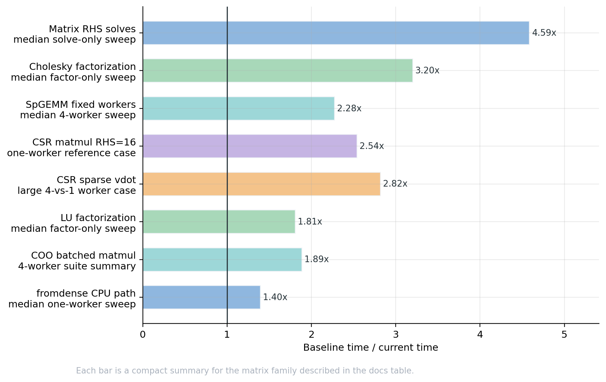
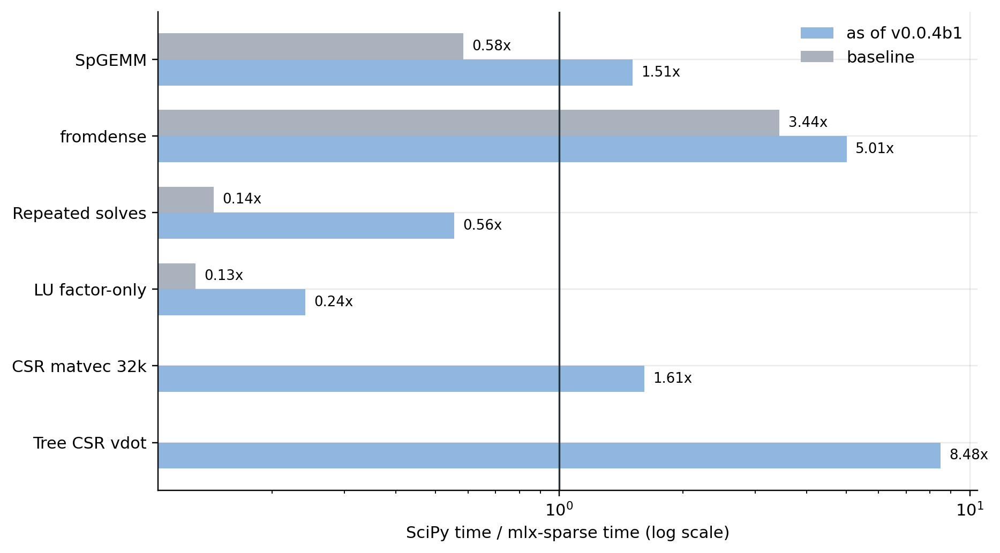
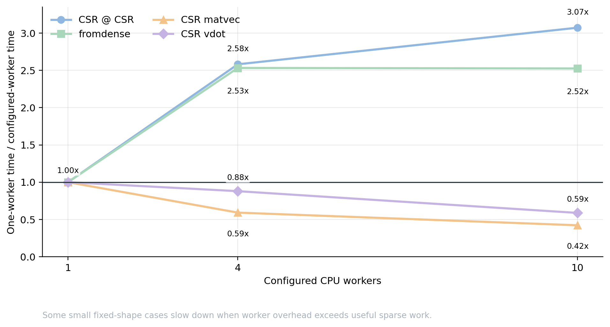
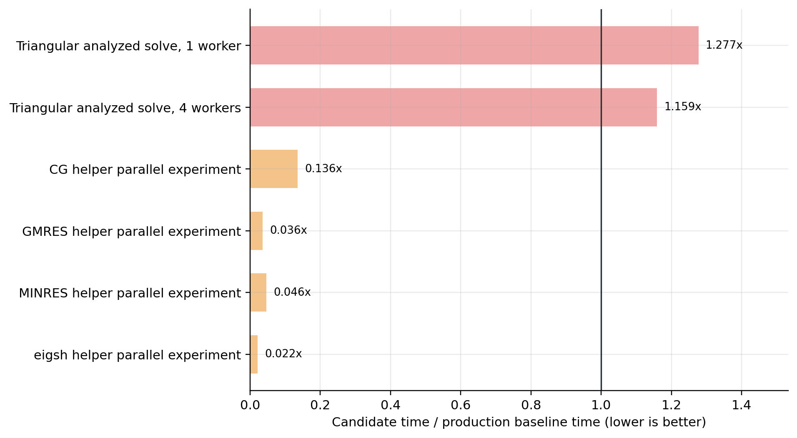

Performance notes for v0.0.4b1
==============================

This page summarizes local release-validation measurements for the native CPU
backend as of v0.0.4b1.  The numbers show direction and scale for the paths
that were optimized.  They are examples from one machine, not portable
performance guarantees.

Reference machine and timing rules
----------------------------------

The reference machine was an Apple MacBook Pro with an Apple M5 chip.  The
benchmark metadata reported 10 hardware workers.  The selected MLX device was
CPU, and the native-extension build used for these runs did not have
Accelerate solver support available.  Unless stated otherwise, values were
``float32`` and sparse indices were ``int32``.

The baseline means the pre-optimization native CPU behavior used during
v0.0.4b1 release validation.  It is a code-path baseline, not a claim about a
fresh wheel installed from a package index.

All sparse timings force real work:

* CSR/CSC outputs evaluate ``data``, ``indices``, and ``indptr``.
* COO outputs evaluate ``data``, ``row``, and ``col``.
* Dense outputs use ``mx.eval(result)``.

.. warning::

   SciPy comparisons on this page are timing context only.  Several
   mlx-sparse measurements use four or ten native CPU workers, while the SciPy
   reference timings are whatever the local SciPy build used by default on the
   same machine.  That is not a strict single-thread apples-to-apples
   comparison.

.. warning::

   Single-thread native CPU performance still trails SciPy on many solver and
   sparse-dense cases.  The SciPy ratio tables are included to make that
   visible, not to imply broad parity with mature Sparse BLAS or sparse solver
   implementations.

Ratio definitions
-----------------

``baseline/current`` means baseline median time divided by the current
mlx-sparse median time.  A value above ``1.0x`` means the current native CPU
path used less time on that benchmark case.

``SciPy/native`` means SciPy median time divided by mlx-sparse median time.
The ratio is useful context, but it mixes library implementations, threading
policies, and solver maturity.

Benchmark matrix catalog
------------------------

Sparse performance is matrix-structure dependent, so the benchmark shape is
part of every result.

.. list-table::
   :header-rows: 1
   :widths: 22 28 26 24

   * - Benchmark family
     - Matrices
     - Sparsity
     - Workers
   * - Same-format SpGEMM
     - CSR/COO/CSC square products, sizes ``512``, ``2048``, ``8192``.
       Families: uniformly short rows, imbalanced rows, banded,
       diagonal-dominant, exact-cancellation, output-density sweeps.
     - Target nonzeros per row ``8`` and ``32`` where applicable.  Max density
       ``0.25``.  Output-density sweep targets ``8`` and ``32`` output nonzeros
       per row.
     - Serial control: one CPU worker and SpGEMM parallel disabled.  Parallel
       run: four SpGEMM workers.
   * - CSR sparse-dense small cases
     - Matvec: ``4096 x 4096`` with ``16,777`` nonzeros.  Matmul:
       ``2048 x 2048`` with ``8,389`` nonzeros and RHS width ``16``.
     - Densities about ``0.0010`` and ``0.0020``.
     - One CPU worker.
   * - CSR sparse-dense large cases
     - Matvec: ``32768 x 32768`` with ``524,288`` nonzeros.  Matmul:
       ``32768 x 32768`` with ``262,144`` nonzeros and RHS width ``16``.
     - Densities ``0.000488`` and ``0.000244``.
     - One and four CPU workers.
   * - COO/CSC batched dense products
     - COO/CSC matvec and matmul, sizes ``512``, ``2048``, ``8192``,
       ``32768``.  Batch size ``4``.  Matmul RHS width ``8``.
     - Families: uniformly short rows, imbalanced rows, banded,
       diagonal-dominant, output-density sweeps.  Target nonzeros per row
       ``2``, ``8``, ``32``.
     - One-worker serial control and four CPU workers.
   * - ``fromdense`` and compressed cleanup
     - Dense-to-CSR inputs, sizes ``512``, ``2048``, ``4096``.  Families:
       uniformly short rows, duplicate-heavy, output-density sweeps.
     - Target output nonzeros per row ``2``, ``8``, ``32`` where applicable.
     - One and four CPU workers.
   * - Scalar reductions
     - CSR/COO/CSC trace plus CSR sparse ``dot``/``vdot`` on a large
       ``4096 x 4096`` case.
     - ``1,048,576`` nonzeros, density ``0.0625``.
     - One and four CPU workers.
   * - Direct factorization
     - Native Cholesky and LU on sizes ``128`` and ``512``.  Families:
       banded SPD, banded general, random SPD, random general.
     - Target nonzeros per row ``4`` and ``16``.  Max density ``0.25``.
     - One CPU worker.
   * - Repeated explicit-factor solves
     - Same matrices as direct factorization.  RHS counts ``1``, ``2``, ``4``,
       ``8``, ``16``, ``32``.
     - Target nonzeros per row ``4`` and ``16``.  Max density ``0.25``.
     - One CPU worker for the production solve-only summary.  Solver
       parallelism disabled by default.
   * - 1/4/10 worker probe
     - CSR @ CSR: ``4096 x 4096`` with LHS ``65,536`` nonzeros and RHS
       ``32,768`` nonzeros.  CSR matvec and CSR ``vdot`` use the same
       ``65,536``-nonzero CSR.  ``fromdense`` uses a ``2048 x 2048`` dense
       input with about ``0.004`` nonzero density after thresholding.
     - Densities: CSR LHS ``0.003906``, CSR RHS ``0.001953``, dense
       constructor target about ``0.004``.
     - One, four, and ten CPU workers.

Selected native CPU speedups
----------------------------

.. list-table::
   :header-rows: 1
   :widths: 26 18 56

   * - Family
     - Summary ratio
     - Matrix and timing scope
   * - Same-format SpGEMM
     - ``2.276x``
     - Median four-worker ratio over 99 CSR/COO/CSC square-product cases from
       the SpGEMM catalog above.
   * - Serial SpGEMM final-writer
     - ``1.016x``
     - Median one-worker ratio over 285 SpGEMM cases.  Exact-cancellation
       cases had median ``1.517x``.
   * - CSR sparse-dense
     - ``1.34x`` to ``2.54x``
     - One-worker small CSR matvec and CSR matmul RHS=16 reference cases.
   * - COO/CSC batched dense products
     - ``1.123x`` to ``1.886x``
     - Four-worker operation summaries over the batched COO/CSC catalog.
   * - ``fromdense``
     - ``1.396x``
     - Median one-worker dense-to-CSR constructor ratio over the ``fromdense``
       catalog.
   * - Matrix-RHS repeated solves
     - ``4.586x``
     - One-worker solve-only median over the direct-solve matrix-RHS catalog.
   * - Direct factorization
     - ``3.201x`` Cholesky, ``1.807x`` LU
     - One-worker factor-only medians over the direct-factorization catalog.
   * - Scalar reductions
     - ``2.82x``
     - Large CSR sparse ``vdot`` with four workers compared with one worker.

SciPy timing context
--------------------

Read this chart together with the warnings above.  Ratios use the local SciPy
reference timings from the same benchmark run, but worker counts and
implementation strategies differ.

.. list-table::
   :header-rows: 1
   :widths: 26 16 16 42

   * - Case
     - Baseline
     - As of v0.0.4b1
     - Matrix and worker details
   * - Same-format SpGEMM
     - ``0.584x``
     - ``1.507x``
     - Median SciPy/native ratio for the SpGEMM sweep.  The v0.0.4b1 value is
       the four-worker SpGEMM run.
   * - ``fromdense``
     - ``3.442x``
     - ``5.012x``
     - Median SciPy/native ratio for one-worker dense-to-CSR cases with sizes
       ``512``, ``2048``, and ``4096``.
   * - Matrix-RHS repeated solves
     - ``0.144x``
     - ``0.555x``
     - One-worker solve-only direct-solve sweep with RHS counts through
       ``32``.
   * - LU factor-only
     - ``0.130x``
     - ``0.241x``
     - One-worker native LU factorization sweep.  SciPy reference is SuperLU.
   * - CSR matvec, 32k
     - n/a
     - ``1.610x``
     - ``32768 x 32768``, ``524,288`` nonzeros, four CPU workers.
   * - CSR sparse ``vdot``
     - n/a
     - ``8.480x``
     - ``4096 x 4096``, ``1,048,576`` nonzeros, four CPU workers.

Thread-count sensitivity
------------------------

The worker-count probe uses evaluated medians on the same M5 machine.  Values
below ``1.0x`` mean the multi-worker setting took longer than one worker for
that small case.

.. list-table::
   :header-rows: 1
   :widths: 24 16 16 16 28

   * - Operation
     - 1 worker
     - 4 workers
     - 10 workers
     - Matrix details
   * - CSR @ CSR
     - ``6.109 ms``
     - ``2.367 ms``
     - ``1.989 ms``
     - ``4096 x 4096``, LHS ``65,536`` nnz, RHS ``32,768`` nnz.
   * - ``fromdense``
     - ``1.655 ms``
     - ``0.654 ms``
     - ``0.655 ms``
     - ``2048 x 2048`` dense input, about ``0.004`` output density.
   * - CSR matvec
     - ``0.039 ms``
     - ``0.066 ms``
     - ``0.092 ms``
     - ``4096 x 4096``, ``65,536`` nnz.  This small case is launch-overhead
       limited.
   * - CSR sparse ``vdot``
     - ``0.0566 ms``
     - ``0.0643 ms``
     - ``0.0963 ms``
     - Same ``4096 x 4096`` / ``65,536`` nnz CSR.  The large reduction sweep
       below is the better case for worker scaling.

Sparse-sparse products
----------------------

As of v0.0.4b1, same-format CSR/COO/CSC host SpGEMM uses deterministic
output-row or output-column ownership.  The sweep used square matrices of
sizes ``512``, ``2048``, and ``8192`` with the families and sparsities listed
in the catalog.

.. list-table::
   :header-rows: 1
   :widths: 22 22 22 34

   * - Operation
     - 4-worker summary vs serial
     - 4-worker summary vs SciPy
     - Notes
   * - CSR @ CSR
     - ``2.106x``
     - ``1.687x``
     - Row-owned output partitions.
   * - COO @ COO
     - ``1.983x``
     - ``1.540x``
     - Row-owned COO output assembly.
   * - CSC @ CSC
     - ``1.836x``
     - ``1.670x``
     - Column-owned output partitions.
   * - Overall median
     - ``2.276x``
     - ``1.507x``
     - 99 records.  Smallest/lightest cases include worker overhead.

Size matters.  The four-worker summary ratios versus the serial control were:

.. list-table::
   :header-rows: 1

   * - Format
     - ``512``
     - ``2048``
     - ``8192``
   * - CSR
     - ``1.625x``
     - ``2.354x``
     - ``2.442x``
   * - COO
     - ``1.659x``
     - ``2.121x``
     - ``2.217x``
   * - CSC
     - ``1.381x``
     - ``2.045x``
     - ``2.193x``

Fixed-shape sparse-dense products
---------------------------------

CSR row-owned products were tested on the small and large cases below.

.. list-table::
   :header-rows: 1
   :widths: 24 26 16 16 18

   * - Case
     - Matrix
     - Before
     - As of v0.0.4b1
     - Ratio
   * - CSR matvec, one worker
     - ``4096 x 4096``, ``16,777`` nnz, density ``0.0010``.
     - ``0.0323 ms``
     - ``0.0242 ms``
     - ``1.34x``
   * - CSR matmul RHS=16, one worker
     - ``2048 x 2048``, ``8,389`` nnz, density ``0.0020``.
     - ``0.0493 ms``
     - ``0.0194 ms``
     - ``2.54x``
   * - CSR matvec, one worker
     - ``32768 x 32768``, ``524,288`` nnz, density ``0.000488``.
     - n/a
     - ``0.3218 ms``
     - n/a
   * - CSR matvec, four workers
     - Same 32k matvec matrix.
     - one-worker current ``0.3218 ms``
     - ``0.2022 ms``
     - ``1.59x``
   * - CSR matmul RHS=16, one worker
     - ``32768 x 32768``, ``262,144`` nnz, density ``0.000244``.
     - n/a
     - ``0.3029 ms``
     - n/a
   * - CSR matmul RHS=16, four workers
     - Same 32k matmul matrix.
     - one-worker current ``0.3029 ms``
     - ``0.2173 ms``
     - ``1.39x``

COO/CSC batched dense products use disjoint batch-slab ownership as of
v0.0.4b1.  The sweep used batch size ``4``, RHS width ``8`` for matmul, sizes
``512`` through ``32768``, and target nonzeros per row ``2``, ``8``, ``32``.

.. list-table::
   :header-rows: 1

   * - Operation
     - Four-worker summary vs serial
     - SciPy/native context
   * - ``coo_batched_matmul``
     - ``1.886x``
     - ``3.064x``
   * - ``coo_batched_matvec``
     - ``1.876x``
     - ``0.833x``
   * - ``csc_batched_matmul``
     - ``1.561x``
     - ``3.218x``
   * - ``csc_batched_matvec``
     - ``1.123x``
     - ``0.973x``

Non-batched COO/CSC forward dense products remain serial because they scatter
into shared dense output rows.

Constructors, conversions, and canonicalization
-----------------------------------------------

The CPU ``fromdense`` path scans dense rows directly into canonical CSR
buffers as of v0.0.4b1.  The constructor sweep used sizes ``512``, ``2048``,
and ``4096`` with target output nonzeros per row ``2``, ``8``, and ``32``.

.. list-table::
   :header-rows: 1

   * - Case
     - Worker setting
     - Summary ratio vs staged CPU baseline
     - SciPy/native context
   * - ``fromdense`` constructor sweep
     - one worker
     - ``1.396x``
     - ``5.012x``
   * - ``fromdense`` constructor sweep
     - four workers
     - ``1.226x``
     - ``14.091x``

Immediate host assembly for compressed ``sum_duplicates`` was measured and
rejected.  The staged count/prefix/fill implementation remains the production
CPU path because it was the better one-worker target in the measured sweep.

Format conversions and transposes were reworked for race-free parallelism with
histogram/prefix/scatter or destination-owned partitions.  Small conversions
can remain overhead-bound, while larger conversion and constructor cases are
the intended targets for deterministic worker-owned ranges.

Reductions and sparse scalar products
-------------------------------------

The large scalar-reduction sweep used ``4096 x 4096`` matrices with
``1,048,576`` nonzeros and density ``0.0625``.

.. list-table::
   :header-rows: 1
   :widths: 22 18 18 18 18

   * - Operation
     - 1 worker
     - 4 workers
     - Worker ratio
     - SciPy/native context
   * - CSR trace
     - ``0.301 ms``
     - ``0.127 ms``
     - ``2.37x``
     - ``2.38x``
   * - COO trace
     - ``0.333 ms``
     - ``0.137 ms``
     - ``2.43x``
     - ``4.15x``
   * - CSC trace
     - ``0.307 ms``
     - ``0.126 ms``
     - ``2.44x``
     - ``2.33x``
   * - CSR sparse ``dot``
     - ``0.668 ms``
     - ``0.262 ms``
     - ``2.55x``
     - ``7.19x``
   * - CSR sparse ``vdot``
     - ``0.677 ms``
     - ``0.240 ms``
     - ``2.82x``
     - ``8.48x``

Some dense conversions and small scalar reductions remain limited by memory
traffic or launch overhead.  In the large reduction sweep, CSC dense
conversion measured ``0.72x`` versus the legacy conversion path and ``0.49x``
on the SciPy/native context ratio.

Direct factorization and repeated solves
----------------------------------------

The direct-factorization work is single-threaded and storage-focused.  It does
not make natural-order Cholesky or LU numerically parallel.

.. list-table::
   :header-rows: 1
   :widths: 25 20 20 35

   * - Phase
     - Native ratio
     - SciPy/native context
     - Matrix scope
   * - Cholesky factor-only
     - ``3.201x``
     - no SciPy sparse Cholesky equivalent
     - Banded/random SPD, sizes ``128`` and ``512``, target nonzeros per row
       ``4`` and ``16``.
   * - Cholesky factor-plus-solve
     - ``2.264x``
     - no SciPy sparse Cholesky equivalent
     - Same SPD sweep.
   * - Cholesky solve-only
     - ``1.076x``
     - no SciPy sparse Cholesky equivalent
     - Same SPD sweep.
   * - LU factor-only
     - ``1.807x``
     - ``0.241x``
     - Banded/random SPD and general matrices, sizes ``128`` and ``512``.
   * - LU factor-plus-solve
     - ``1.881x``
     - ``0.226x``
     - Same LU sweep.
   * - LU solve-only
     - ``0.965x``
     - ``0.241x``
     - Same LU sweep.

By family, Cholesky factor-only medians were ``1.995x`` on banded SPD and
``6.275x`` on random SPD matrices.  LU factor-only medians were ``1.370x`` on
banded SPD, ``1.490x`` on banded general, ``2.405x`` on random SPD, and
``2.348x`` on random general matrices.

Matrix-RHS repeated solves remove Python column loops.  The sweep used RHS
counts ``1``, ``2``, ``4``, ``8``, ``16``, and ``32``.

.. list-table::
   :header-rows: 1

   * - Case
     - Result
   * - Overall, one worker
     - Median after/before ratio ``0.218x``.  Equivalently ``4.586x`` lower
       median solve time.
   * - Cholesky ``nrhs=32``
     - Median ratio ``0.050x``.
   * - LU ``nrhs=32``
     - Median ratio ``0.049x``.
   * - SciPy/native context
     - One-worker solve-only ratio moved from ``0.144x`` to ``0.555x``.

Measured but not adopted
------------------------

Several plausible HPC ideas were tested and rejected for production because
they did not improve the relevant measured target:

* Cached triangular diagonal positions and dependency-level scheduling were
  guarded by graph analysis and had row-order fallback, but the analyzed solve
  path measured ``1.277x`` slower than baseline at one worker and ``1.159x``
  slower at four solver workers.
* Iterative and spectral solver helper parallelism regressed the benchmark
  slice.  For the ``1024 x 1024`` solver check with ``3,120`` nonzeros, CG
  moved from ``0.0320 ms`` to ``0.2358 ms``, GMRES from ``0.4459 ms`` to
  ``12.3347 ms``, and MINRES from ``21.4326 ms`` to ``463.6496 ms`` under the
  fixed-worker helper experiment.
* Immediate host assembly for compressed ``sum_duplicates`` did not improve
  the one-worker target and was not shipped.
* Non-batched COO/CSC forward dense products stayed serial rather than using
  unsynchronized scatter writes.
